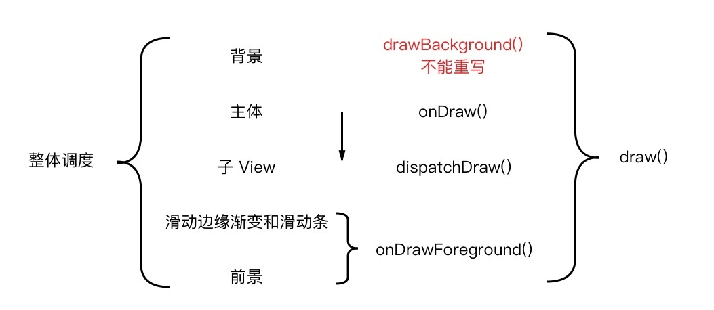
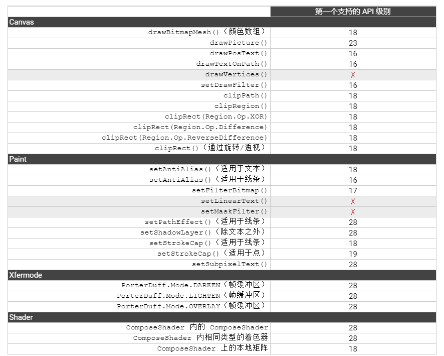
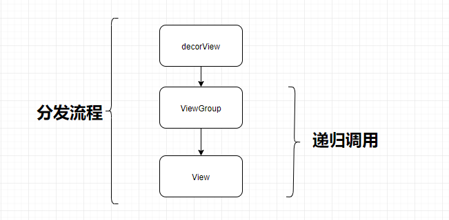

# 自定义View

### 自定义绘制

1、绘制顺序

    onDraw() -> dispatchDraw()
    
    每个 View 和 ViewGroup 都会先调用 onDraw() 方法来绘制主体，
    再调用 dispatchDraw() 方法来绘制子 View。

2、绘制过程

    背景：xml布局文件的 android:background 属性 
    主体：onDraw()
    子View：dispatchDraw()
    滑动边缘渐变和滑动条 onDrawForeground() API 23 加入
    前景 onDrawForeground()

3、draw() 总调度方法

4、注意事项

    在 ViewGroup 的子类中重写除 dispatchDraw() 以外的绘制方法时，  
    可能需要调用 setWillNotDraw(false)；
    
    在重写的方法有多个选择时，优先选择 onDraw()。

### 硬件加速

是什么?

    在 Android 里，硬件加速专指把 View 中绘制的计算工作交给 GPU 来处理

为什么？

    用了 GPU，绘制变快了；
    
    绘制机制的改变，导致界面内容改变时的刷新效率极大提高。

怎么用？

硬件加速开启时，方法有Api限制

[Google 官方文档](https://developer.android.google.cn/guide/topics/graphics/hardware-accel#determining)

### 自定义ViewGroup

    重写 onMeasure()、在该方法中计算每个子View的大小，再设置自己的大小
    
    重写 onLayout()、在该方法中调用每个子View的 Layout() 方法

### 事件分发机制

###### boolean dispatchTouchEvent(MotionEvent event)
    1、分发用户手势
    
    2、True if the event was handled(处理) by the view, false otherwise. 

###### boolean onInterceptTouchEvent(MotionEvent ev)
    1、拦截手势操作，ViewGroup 类的方法，View类没有
    
    2、dispatchTouchEvent() 方法内会调用改方法 
     
    3、return false 所有事件会先使用该方法处理，
    再传给target's onTouchEvent()。
    
    4、return true target view will receive the same event but
    with the action {@link MotionEvent#ACTION_CANCEL}。
    其他事件直接通过dispatchTouchEvent()发给该View的 onTouchEvent()，
    不再经过onInterceptTouchEvent()方法

###### boolean onTouchEvent(MotionEvent event)
    1、dispatchTouchEvent() 方法内会调用改方法
    
    2、调用onClick()的地方
    
    3、如果处理了事件，则返回true，否则为false。
    若不消耗，则在同一事件序列中，当前View无法再次接收到事件
    
###### MotionEvent.ACTION_CANCEL 何时调用
    1、父View未拦截Down，但是拦截了Move、Up时；子View会收到Down 和 Cancel
    
    2、RecyclerView滑动时、子View会收到Cancel。滑动超过一定距离、Recyclerview的onInterceptTouchEvent()会判断用户是想滑动、从而拦截并消费后续的事件。
