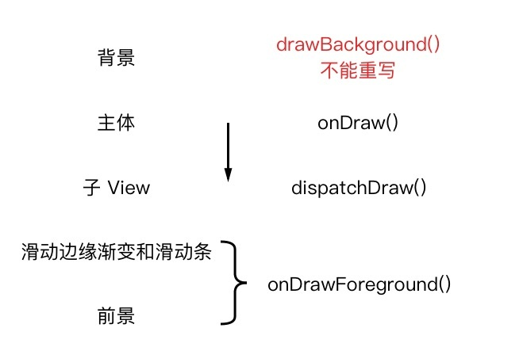

# 自定义View

### 绘制顺序

1、绘制顺序

    onDraw() -> dispatchDraw()
    
    每个 View 和 ViewGroup 都会先调用 onDraw() 方法来绘制主体，
    再调用 dispatchDraw() 方法来绘制子 View。

2、绘制过程

    背景：xml布局文件的 android:background 属性 
    主体：onDraw()
    子View：dispatchDraw()
    滑动边缘渐变和滑动条 onDrawForeground() API 23 加入
    前景 onDrawForeground()

3、draw() 总调度方法

4、注意事项

    在 ViewGroup 的子类中重写除 dispatchDraw() 以外的绘制方法时，  
    可能需要调用 setWillNotDraw(false)；
    
    在重写的方法有多个选择时，优先选择 onDraw()。

### 硬件加速

是什么?

    在 Android 里，硬件加速专指把 View 中绘制的计算工作交给 GPU 来处理

为什么？

    用了 GPU，绘制变快了；
    
    绘制机制的改变，导致界面内容改变时的刷新效率极大提高。

怎么用？

硬件加速开启时，方法有Api限制

[Google 官方文档](https://developer.android.google.cn/guide/topics/graphics/hardware-accel#determining)